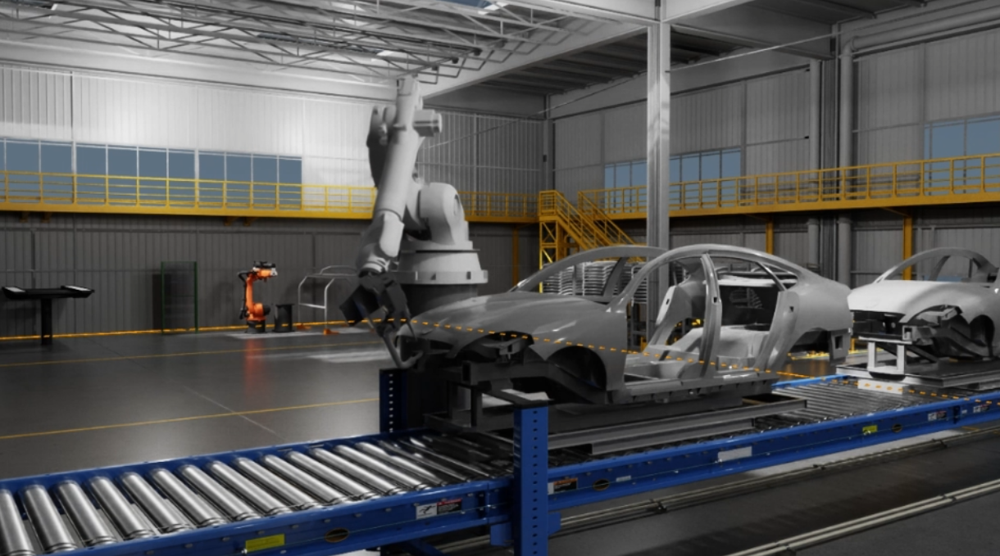
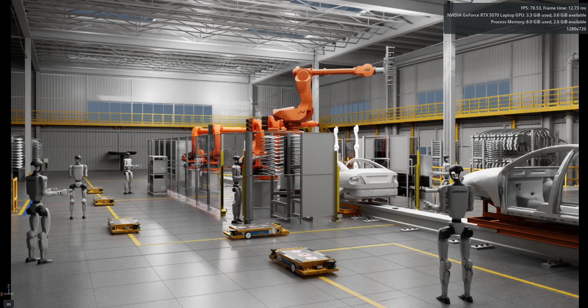
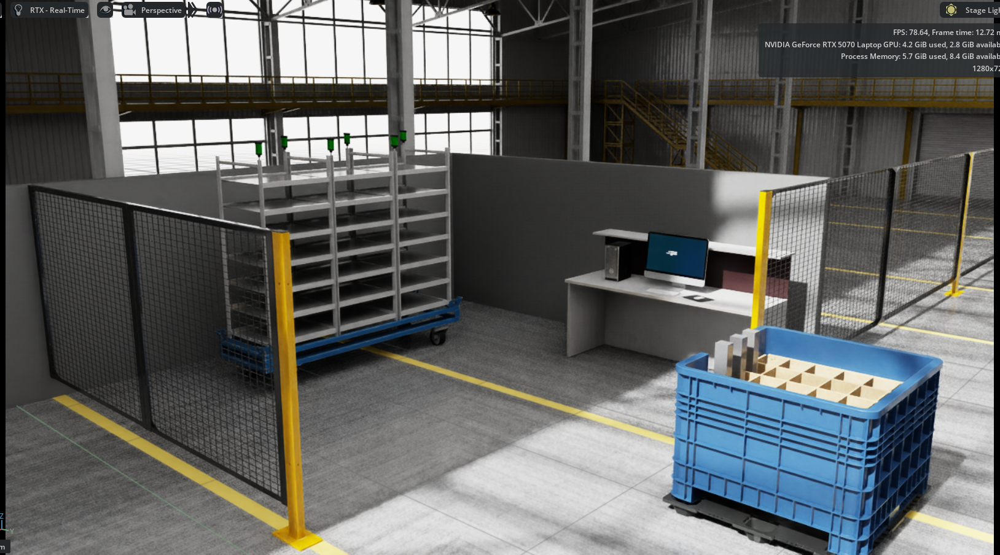

<div align="center">
  <p>
    <a align="center" href="" target="_blank">
      
    </a>
  </p>

  <p align="center">
    <a href="https://pypi.org/project/telekinesis-ai/">
      
    </a>
    <a href="https://pypi.org/project/telekinesis-ai/">
      
    </a>
    <a href="https://pypi.org/project/telekinesis-ai/">
      
    </a>
    <a href="https://docs.telekinesis.ai">
      
    </a>
  </p>

  <h2>Any robot. Any task. One Physical AI platform.</h2>

  <p>
    <a href="https://docs.telekinesis.ai/">Telekinesis Docs</a>
    &nbsp;•&nbsp;
    <a href="https://discord.gg/S5v8bYAnc6">Discord</a>
    &nbsp;•&nbsp;
    <a href="https://www.linkedin.com/company/telekinesis-ai/">LinkedIn</a>
    &nbsp;•&nbsp;
    <a href="https://x.com/telekinesis_ai">X</a>
    &nbsp;•&nbsp;
    <a href="https://telekinesis.ai/">Website</a>

</p>
</div>


# isaacsim-examples

isaacsim-examples provides Isaac Sim examples for loading and controlling the robot, including set/get robot state demos and robot/end-effector model assets.


## Getting Started

The complete applications use two separate processes:

1. **Isaac Sim** runs the stage, physics, and the Telekinesis bridge.
2. **The application environment** runs Synapse, TF, and the Python files in
   `examples/`.

Do not install Isaac Sim into the application environment. The examples in
this repository were calibrated with Isaac Sim 5.1. The bridge is tested with
Isaac Sim 5.1 and 6.0; use the Python version that belongs to that Isaac Sim
release (Python 3.11 for 5.1 and Python 3.12 for 6.0).

## Installation

### 1. Install and Start Isaac Sim

Install a supported Isaac Sim release through your normal distribution
channel and start the full Isaac Sim application. Use Isaac Sim 5.1 to
reproduce the calibrated scenes and motion values in this repository.

### 2. Install the Telekinesis Isaac Sim Bridge

Clone the bridge extension next to this repository:

```bash
git clone https://github.com/telekinesis-ai/telekinesis-isaacsim-extension.git
```

In Isaac Sim:

1. Open **Window > Extensions**.
2. Open the extension settings and add the absolute
   `telekinesis-isaacsim-extension/exts` directory to the extension search
   paths. On Windows, use forward slashes in this path.
3. Search for `telekinesis.isaacsim.bridge`, enable it, and select
   **Autoload**.
4. For the palletizing, automotive assembly, and automotive spot-welding
   applications, also enable `isaacsim.code_editor.vscode`. Their backend
   modules use its local code socket for conveyor, lightbeam, spawning, and
   other scene-side operations.

After Isaac Sim starts, verify the bridge from PowerShell:

```powershell
Invoke-RestMethod http://127.0.0.1:8766/status
```

The response should report that the bridge is running.

### 3. Create the Application Environment

Create a separate Python 3.12 environment for Synapse and the external
applications:

```bash
conda create -n telekinesis-apps python=3.12
conda activate telekinesis-apps
python -m pip install --upgrade pip
```

Install the robot descriptions and Synapse:

```bash
cd path/to/working_directory
git clone --depth 1 https://github.com/telekinesis-ai/telekinesis-urdfs.git
cd telekinesis-urdfs
python -m pip install .

python -m pip install telekinesis-synapse
```

Installing Synapse also installs the Telekinesis Isaac Sim client, TF,
Rerun, and the other application dependencies. A user installation does not
require building Synapse or the Isaac Sim client from source.

Clone this repository:

```bash
cd path/to/working_directory
git clone https://github.com/telekinesis-ai/isaacsim-examples.git
cd isaacsim-examples
```

Verify the application environment:

```bash
python -c "from telekinesis.synapse.robots.manipulators import universal_robots; universal_robots.UniversalRobotsUR10E(); print('Synapse ready')"
```

<details>
<summary><strong>Robot colors in Isaac Sim 5.1 and 6.0.1-generated USD assets</strong></summary>

Isaac Sim 5.1 may import some vendor URDF material definitions differently from Isaac Sim 6.0.1. This repository therefore provides separate physics-compatible URDFs and static, full-color USD assets for this example.

Choose the asset workflow based on what the scene needs:

- **Physics and robot control:** import the bundled Kuka, ABB, and Unitree URDFs from their `assets/robots/<robot>/urdf/` directories using the Isaac Sim 5.1 URDF Importer. Import Neura MAiRA from `telekinesis-urdfs`. These assets retain their Isaac Sim 5.1 articulation and joint physics, although their colors may be less vibrant than the 6.0.1-generated USDs.
- **Static full-color visualization:** add the top-level Kuka, ABB, and Unitree USDA files from their `assets/robots/<robot>/usd/` directories. They were generated by Isaac Sim 6.0.1 and are already saved with the **Physics** variant set to **none**. Neura MAiRA still uses its URDF in this mode.

The 6.0.1-generated USD assets are intended only for screenshots or static previews in a 5.1 scene. Enabling their physics in 5.1 produces incompatible rigid-body hierarchy and joint initialization errors. Use the URDF workflow whenever the example needs articulation, physics, or joint control.

</details>

## Examples

| File | Description |
|------|-------------|
| `examples/palletizing.py` | Multi-brand palletizing demo mounts a robot, moves to home, runs the conveyor and stops it when a box reaches the lightbeam sensor. Change one line to switch between all 7 supported brands. |
| `examples/automotive_assembly.py` | Multi-brand automotive assembly demo mounts a heavy industrial robot on a pedestal in a vehicle-factory scene, faces the work cell, moves to home, and attaches a suction gripper to the flange. Change one line to switch brands (Kuka, ABB, Neura). |
| `examples/all_robots_automotive.py` | Full automotive factory scene populated in one run: 9 industrial arms (Kuka, ABB, Neura) on pedestals, 9 Unitree G1 humanoids, and 11 Idealworks iw.hub robots. Import one base prim per brand; the script duplicates the rest. Toggle `VISUAL_MODE` for a static full-color scene or physics simulation. |
| `examples/cnc_machine_tending.py` | Multi-brand machine-tending demo spawns a small collaborative or industrial robot on a mount point next to a CNC machine and drives it to a ready pose. Change one line to switch between UR10e, Franka, Fanuc, Motoman, and Neura. |
| `examples/add_physics_to_prim.py` | Adds rigid body and SDF collider physics to any prim in the open stage. |
| `examples/remove_timeline.py` | Strips animation curves from a USD stage and exports a static version useful when imported assets animate unexpectedly during physics simulation. |
| `examples/examine_tree.py` | Prints the full prim tree of the open stage useful for inspecting scene structure and finding prim paths. |

### Complete TF Application Files

The complete workflows use the same file pattern:

```text
examples/
|-- <application>_static_frames_visualization.py
|-- <application>_application_multi_robot.py
`-- <application>_isaacsim_backend.py
```

| File role | Purpose |
|-----------|---------|
| `*_static_frames_visualization.py` | Stores the calibrated static transforms, builds the TF tree, and visualizes it in Rerun. It does not move the robot. |
| `*_application_multi_robot.py` | Contains the robot configuration, attaches the tool, resolves target poses from TF, and runs the task cycle through Synapse. |
| `*_isaacsim_backend.py` | Contains scene-side operations that are not yet available through the bridge, such as conveyor control, lightbeam reads, spawning, and live object measurements. Only applications that need those operations have this file. |

The machine-tending workflow uses the first two files. Palletizing,
automotive assembly, and automotive spot welding use all three files. Run the
application files from the external `telekinesis-apps` environment, not from
Isaac Sim's Python process.


## Palletizing Scene Demo

Demonstrates a palletizing workflow across all 7 supported robot brands in Isaac Sim. A robot mounts on a stand or floor anchor, moves to its home configuration, and stops the conveyor when a box arrives at the lightbeam sensor.


### Scene USDs

Two ready-to-use scenes are provided under `assets/environments/palletizing/`:

| File | Robots |
|------|--------|
| `palletizing_stand.usd` | UR10e, Franka Panda, Fanuc CRX-10iA/L, Motoman MH5, Neura MAiRA 7M — compact and medium arms on the stand |
| `palletizing_floor.usd` | Kuka KR210 L150, ABB IRB7600 — large industrial arms placed directly on the floor |

### How to Run

1. Open Isaac Sim.
2. Open the scene USD that matches your robot (`File → Open`).
3. Import the robot URDF via `Isaac Utils → URDF Importer` with **Fix Base = ON**. The robot spawns at the world origin; the script repositions it automatically.
4. Open `examples/palletizing.py` in VS Code.
5. Set `ACTIVE_ROBOT` at the top of the file to your robot brand:

   ```python
   ACTIVE_ROBOT = "ur10e"   # or "franka", "fanuc", "motoman", "kuka", "neura", "abb"
   ```

### Complete TF Application

The verified complete workflow uses the UR10e and the modeled Defitech
suction gripper.

| Requirement | Expected value |
|-------------|----------------|
| Scene | `assets/environments/palletizing/palletizing_stand.usd` |
| Robot | UR10e imported at `/World/ur10e_robot` |
| Gripper asset | `assets/tools/defitech_modelled_surface_gripper_modelled.usd` |
| Gripper prim | `/World/defitech_modelled_surface_gripper_modelled` |
| TF file | `examples/palletizing_static_frames_visualization.py` |
| Application | `examples/palletizing_application_multi_robot.py` |
| Isaac Sim backend | `examples/palletizing_isaacsim_backend.py` |

1. Open the scene in Isaac Sim.
2. Import the UR10e with **Fix Base** enabled and rename its root prim to
   `/World/ur10e_robot` if necessary.
3. Drag the modeled Defitech gripper asset onto `/World` and confirm the prim
   path shown above.
4. Enable `telekinesis.isaacsim.bridge` and
   `isaacsim.code_editor.vscode`.
5. Stop or reset the timeline before starting a fresh run.
6. From the external application environment, visualize the calibrated TF
   tree if required, then run the application:

   ```bash
   cd path/to/isaacsim-examples/examples
   python palletizing_static_frames_visualization.py
   python palletizing_application_multi_robot.py --ur10e
   ```

The backend controls the conveyors and lightbeam through Isaac Sim's local
code socket. The robot and gripper communication still goes through the
Telekinesis bridge.


## Automotive Assembly Scene Demo

Demonstrates a multi-brand automotive material-handling workflow in Isaac Sim. A large industrial robot mounts on a pedestal in a vehicle-factory scene, rotates to face the work cell, moves to its home configuration, and is coupled to a suction gripper for sheet-metal handling.


### Scene USDs

The scene and the gripper asset are provided separately:

| File | Contents |
|------|----------|
| `assets/environments/automotive_assembly/automotive_assembly.usd` | Vehicle-factory environment with the pedestal and the sledge (car body) |
| `assets/tools/suction_gripper.usd` | Suction gripper end-effector, added to the scene by the user |

Supported robots (large industrial arms): **Kuka KR210 L150**, **ABB IRB7600**, **Neura MAiRA 7M**.

### How to Run

1. Open Isaac Sim.
2. Open `assets/environments/automotive_assembly/automotive_assembly.usd` (`File → Open`).
3. Import the robot URDF via `Isaac Utils → URDF Importer` with **Fix Base = ON**. The robot spawns at the world origin; the script repositions it onto the pedestal automatically.
4. Add the suction gripper: in the **Content** browser, browse to the repo folder `isaacsim-examples/assets/tools/` and drag **`suction_gripper.usd`** into the viewport (or onto `/World` in the Stage tree). Confirm its prim path matches `GRIPPER_PRIM_PATH` / `GRIPPER_BODY_PATH` in the script.
5. Open `examples/automotive_assembly.py` in VS Code.
6. Set `ACTIVE_ROBOT` at the top of the file to your robot brand, then run:

   ```python
   ACTIVE_ROBOT = "kuka"   # or "abb", "neura"
   ```

### Complete TF Application

The complete roof-placement workflow uses the Kuka KR210 L150 and the modeled
multi-cup suction gripper.

| Requirement | Expected value |
|-------------|----------------|
| Scene | `assets/environments/automotive_assembly/automotive_assembly.usd` |
| Robot | Kuka KR210 L150 imported at `/World/kuka_kr210` |
| Gripper asset | `assets/tools/suction_gripper_modelled.usd` |
| Gripper prim | `/World/suction_gripper_modelled` |
| TF file | `examples/automotive_assembly_static_frames_visualization.py` |
| Application | `examples/automotive_assembly_application_multi_robot.py` |
| Isaac Sim backend | `examples/automotive_assembly_isaacsim_backend.py` |

1. Open the scene in Isaac Sim.
2. Import the Kuka with **Fix Base** enabled and confirm its root prim is
   `/World/kuka_kr210`.
3. Drag `suction_gripper_modelled.usd` onto `/World` and confirm its prim is
   `/World/suction_gripper_modelled`.
4. Enable `telekinesis.isaacsim.bridge` and
   `isaacsim.code_editor.vscode`.
5. Stop or reset the timeline before starting a fresh run.
6. From the external application environment, visualize the TF tree if
   required, then run the application:

   ```bash
   cd path/to/isaacsim-examples/examples
   python automotive_assembly_static_frames_visualization.py
   python automotive_assembly_application_multi_robot.py --kuka
   ```

The backend handles the conveyors, lightbeam, runtime car and roof spawning,
and the fixed joint that keeps each placed roof on its car.


## Automotive Spot Welding Scene Demo

Demonstrates a complete automotive spot-welding cycle. Cars move to the
lightbeam station, a Kuka KR210 moves the modeled welding gun through the
car-relative pre-weld and weld frames, the gun closes and shows both sparks,
and the car leaves while the next car is prepared.



### Complete TF Application

| Requirement | Expected value |
|-------------|----------------|
| Scene | `assets/environments/spot_welding_automotive_assembly/spot_welding_automotive.usd` |
| Robot | Kuka KR210 L150 imported at `/World/kuka_kr210` |
| Welding-gun asset | `assets/tools/spot_welding_gun_modelled.usd` |
| Welding-gun prim | `/World/spot_welding_gun_modelled` |
| TF file | `examples/spot_welding_automotive_static_frames_visualization.py` |
| Application | `examples/spot_welding_automotive_application_multi_robot.py` |
| Isaac Sim backend | `examples/spot_welding_automotive_isaacsim_backend.py` |

This application requires a Synapse release that provides
`telekinesis.synapse.tools.welding_gun.SpotWeldingGun`.

1. Open the spot-welding scene in Isaac Sim.
2. Import the Kuka with **Fix Base** enabled and confirm its root prim is
   `/World/kuka_kr210`.
3. Drag `spot_welding_gun_modelled.usd` onto `/World` and confirm its prim is
   `/World/spot_welding_gun_modelled`.
4. Enable `telekinesis.isaacsim.bridge` and
   `isaacsim.code_editor.vscode`.
5. Stop or reset the timeline before starting a fresh run.
6. From the external application environment, visualize the TF tree if
   required, then run the application:

   ```bash
   cd path/to/isaacsim-examples/examples
   python spot_welding_automotive_static_frames_visualization.py
   python spot_welding_automotive_application_multi_robot.py --kuka
   ```

The backend controls the conveyors, reads the lightbeam, measures the stopped
car, updates the dynamic car-relative weld frames, and recycles the two car
slots. Synapse controls the Kuka and the welding gun through the Telekinesis
bridge.


## All-Robots Automotive Scene Demo

Populates a full automotive factory in a single run: 9 heavy industrial arms on the welding pedestals, 9 Unitree G1 humanoids, and 11 Idealworks iw.hub mobile robots across the floor. An ABB IRB7600 on the RobotController pedestal carries a suction gripper. Import one base prim per robot type and the script duplicates and positions all remaining instances automatically.



### Modes

Toggle `VISUAL_MODE` at the top of `examples/all_robots_automotive.py`:

- **`VISUAL_MODE = False` (physics simulation):** import the bundled Kuka, ABB, and Unitree URDFs via `Isaac Utils → URDF Importer` (**Fix Base = ON**), and import Neura MAiRA from `telekinesis-urdfs`. Articulation, joint drives, and the gripper weld are enabled.
- **`VISUAL_MODE = True` (static full-color scene):** add the top-level Kuka, ABB, and Unitree USDA files from their `assets/robots/<robot>/usd/` directories. These 6.0.1-generated assets are saved with `Physics = none`; Play is not called and the gripper is positioned visually without a physics joint. Import Neura MAiRA from its URDF in either mode.

### Scene USDs

| File | Contents |
|------|----------|
| `assets/environments/all_robots_automotive/automotive_warehouse.usd` | Automotive factory environment with the welding-assembly pedestals and no spawned robots |
| `assets/tools/suction_gripper.usd` | Suction gripper end-effector for the ABB on the RobotController pedestal |

Supported arms: **Kuka KR210 L150**, **ABB IRB7600**, **Neura MAiRA 7M**. Also spawns **Unitree G1** humanoids and **Idealworks iw.hub** robots.

### How to Run

1. Open Isaac Sim.
2. Open `assets/environments/all_robots_automotive/automotive_warehouse.usd` (`File → Open`).
3. Add **one** source robot for each required type:
   - Kuka: `assets/robots/kuka_kr210/urdf/kr210l150.urdf` in physics mode, or `assets/robots/kuka_kr210/usd/kuka_kr210.usda` in visual mode.
   - ABB: `assets/robots/abb_irb7600_150_350/urdf/irb7600_150_350.urdf` in physics mode, or `assets/robots/abb_irb7600_150_350/usd/abb_irb7600_150_350.usda` in visual mode.
   - Neura MAiRA: import `maira7M.urdf` from `telekinesis-urdfs` in either mode.
   - Unitree G1: `assets/robots/g1_29dof_with_hand/urdf/g1_29dof_with_hand.urdf` in physics mode, or `assets/robots/g1_29dof_with_hand/usd/g1_29dof_with_hand.usda` in visual mode.
   - Idealworks iw.hub: add NVIDIA's built-in `Isaac/Robots/Idealworks/iwhub/iw_hub.usd` in either mode.

   Keep the resulting source prims at the paths configured by `ARM_BASE_PRIMS`, `HUMANOID_BASE_PATH`, and `IWHUB_BASE_PATH`. The script duplicates and positions all remaining instances.
4. Add the suction gripper: drag `assets/tools/suction_gripper.usd` into the stage and confirm its prim path matches `GRIPPER_PRIM_PATH` / `GRIPPER_BODY_PATH`.
5. Open `examples/all_robots_automotive.py`, set `VISUAL_MODE` for the mode you want, and run via the Isaac Sim VS Code Extension or the Kit Script Editor.


## Machine Tending Scene Demo

Demonstrates multi-brand robot spawning in a warehouse digital-twin scene next to a CNC machine. A small collaborative or industrial robot is placed on the mount point, oriented to face the machine, and driven to a gentle ready pose. Change one line to switch between all supported brands.


### Scene USDs

| File | Contents |
|------|----------|
| `assets/environments/cnc_machine_tending/cnc_machine_tending.usd` | Small warehouse digital-twin environment with the CNC machine and robot mount point |

Supported robots: **UR10e**, **Franka Panda**, **Fanuc CRX-10iA/L**, **Motoman MH5**, **Neura MAiRA 7M**.

> **Note:** The CNC machine asset in this scene uses a USD from [Extwin Synthesis](https://synthesis.extwin.com/#/home). See [Third-Party Assets](#third-party-assets) for full credits.

### How to Run

1. Open Isaac Sim.
2. Open `assets/environments/cnc_machine_tending/cnc_machine_tending.usd` (`File → Open`).
3. Add the robot from the Content Browser or import via `Isaac Utils → URDF Importer` with **Fix Base = ON**. Confirm the `prim_path` in the registry matches the Stage tree.
4. Open `examples/cnc_machine_tending.py` in VS Code.
5. Set `ACTIVE_ROBOT` at the top of the file to your robot brand, then run:

   ```python
   ACTIVE_ROBOT = "ur10e"   # or "motoman", "franka", "neura", "fanuc"
   ```

### Complete TF Application

The verified complete workflow uses the UR10e with an OnRobot RG2. The Fanuc
configuration in the multi-robot file is currently a prototype; use the UR10e
for the reproducible walkthrough below.

| Requirement | Expected value |
|-------------|----------------|
| Scene | `assets/environments/cnc_machine_tending/cnc_machine_tending.usd` |
| Robot | UR10e imported at `/World/ur10e_robot` |
| Gripper | Compatible OnRobot RG2 imported at `/World/onrobot_rg2_model` |
| TF file | `examples/cnc_machine_tending_static_frames_visualization.py` |
| Application | `examples/machine_tending_application_multi_robot.py` |
| Isaac Sim backend | Not required; all scene operations use the bridge |

1. Open the scene in Isaac Sim.
2. Import the UR10e with **Fix Base** enabled and confirm its root prim is
   `/World/ur10e_robot`.
3. Import a compatible OnRobot RG2 at `/World/onrobot_rg2_model`. Set its
   import-dialog **Natural Frequency** to `0` so the fingers do not sag.
4. Enable `telekinesis.isaacsim.bridge`. The code-editor socket is not needed
   for this application.
5. Stop or reset the timeline before starting a fresh run.
6. From the external application environment, visualize the TF tree if
   required, then run the application:

   ```bash
   cd path/to/isaacsim-examples/examples
   python cnc_machine_tending_static_frames_visualization.py
   python machine_tending_application_multi_robot.py --ur10e
   ```


## Material Handling Scene

A general-purpose humanoid material handling environment with shelving racks, an input bin with grid slots, and safety barriers. Load this asset to carry out any material handling application with a humanoid robot.



### Scene USDs

| File | Contents |
|------|----------|
| `assets/environments/material_handling/material_handling.usd` | Warehouse environment with shelving rack, tote container, humanoid robot, office area, and safety fencing |


## Third-Party Assets

Some scene assets are sourced from third-party providers. We gratefully acknowledge their work.

| Asset | Scene | Provider | Repository |
|-------|-------|----------|------------|
| CNC machine (`model_machine003_1_0.usd`) | Machine Tending | [Extwin Synthesis](https://synthesis.extwin.com/#/home) | [Synthesis Assets Explorer](https://github.com/Extwin-Synthesis/Synthesis-Assets-Explorer) |
| Shelf rack (`model_shelf003_0.usd`) | Material Handling | [Extwin Synthesis](https://synthesis.extwin.com/#/home) | [Synthesis Assets Explorer](https://github.com/Extwin-Synthesis/Synthesis-Assets-Explorer) |

### Credits

**Extwin Synthesis** — Digital twin assets used in the machine tending scene are provided by [Extwin Synthesis](https://synthesis.extwin.com/#/home). Synthesis offers a library of industrial digital twin assets for simulation. For the full asset catalogue see their [GitHub repository](https://github.com/Extwin-Synthesis/Synthesis-Assets-Explorer).


## Support

For issues and questions:
- Create an issue in the Github repository
- Contact the development team
