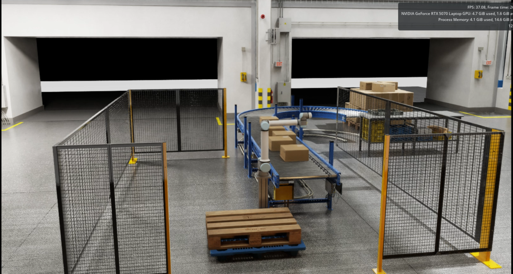
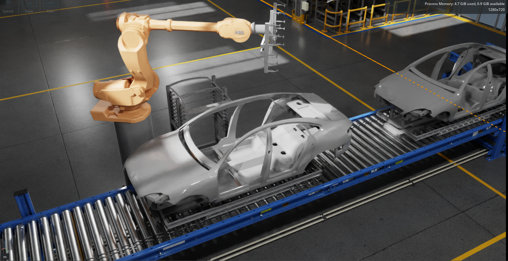
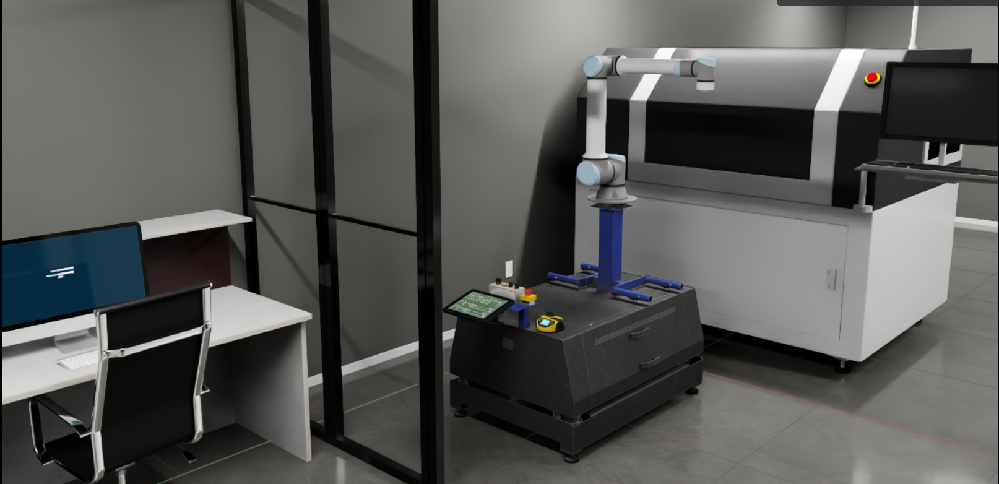

<div align="center">
  <p>
    <a align="center" href="" target="_blank">
      
    </a>
  </p>

  <p align="center">
    <a href="https://pypi.org/project/telekinesis-ai/">
      
    </a>
    <a href="https://pypi.org/project/telekinesis-ai/">
      
    </a>
    <a href="https://pypi.org/project/telekinesis-ai/">
      
    </a>
    <a href="https://docs.telekinesis.ai">
      
    </a>
  </p>

  <h2>Any robot. Any task. One Physical AI platform.</h2>

  <p>
    <a href="https://docs.telekinesis.ai/">Telekinesis Docs</a>
    &nbsp;•&nbsp;
    <a href="https://discord.gg/S5v8bYAnc6">Discord</a>
    &nbsp;•&nbsp;
    <a href="https://www.linkedin.com/company/telekinesis-ai/">LinkedIn</a>
    &nbsp;•&nbsp;
    <a href="https://x.com/telekinesis_ai">X</a>
    &nbsp;•&nbsp;
    <a href="https://telekinesis.ai/">Website</a>

</p>
</div>


# isaacsim-examples

isaacsim-examples provides Isaac Sim examples for loading and controlling the robot, including set/get robot state demos and robot/end-effector model assets.


## Getting Started

> **Already have a Telekinesis or Synapse environment?** You can reuse it — skip the environment setup below and go straight to [Installation](#installation). See the [quickstart guide](https://docs.telekinesis.ai/getting-started/quickstart.html) for reference.

### Conda Environment

It is highly recommended to install a Miniconda environment before setting up the project. You can install Miniconda by following instructions from [here](https://docs.conda.io/en/latest/miniconda.html#installing).

Create a new Conda environment:

```bash
conda create -n isaacsim-examples python=3.11
conda activate isaacsim-examples
```

## Installation

1. Clone the repository:
    ```bash
    cd path/to/working_directory
    git clone https://github.com/telekinesis-ai/isaacsim-examples.git
    ```

2. On Windows, enable long path support to avoid installation errors:

    ```bash
    # PowerShell (run as administrator)
    New-ItemProperty -Path "HKLM:\SYSTEM\CurrentControlSet\Control\FileSystem" `
    -Name "LongPathsEnabled" -Value 1 -PropertyType DWORD -Force
    ```

3. Install `telekinesis-urdfs`:
    ```bash
    cd /path/to/working/directory
    git clone --depth 1 https://github.com/telekinesis-ai/telekinesis-urdfs.git
    cd telekinesis-urdfs
    pip install .
    ```

    > **Note:** `telekinesis-urdfs` is a large repository. The initial clone and wheel build are expected to take several minutes — do not interrupt the process.

4. Install `isaacsim`:
    ```bash
    pip install isaacsim[all,extscache]==5.1.0 --extra-index-url https://pypi.nvidia.com
    ```

5. Install `telekinesis-synapse`:
    ```bash
    pip install telekinesis-synapse
    ```

## Examples

| File | Description |
|------|-------------|
| `examples/palletizing.py` | Multi-brand palletizing demo mounts a robot, moves to home, runs the conveyor and stops it when a box reaches the lightbeam sensor. Change one line to switch between all 7 supported brands. |
| `examples/automotive_assembly.py` | Multi-brand automotive assembly demo mounts a heavy industrial robot on a pedestal in a vehicle-factory scene, faces the work cell, moves to home, and attaches a suction gripper to the flange. Change one line to switch brands (Kuka, ABB, Neura). |
| `examples/machine_tending.py` | Multi-brand machine-tending demo spawns a small collaborative or industrial robot on a mount point next to a CNC machine and drives it to a ready pose. Change one line to switch between UR10e, Franka, Fanuc, Motoman, and Neura. |
| `examples/add_physics_to_prim.py` | Adds rigid body and SDF collider physics to any prim in the open stage. |
| `examples/remove_timeline.py` | Strips animation curves from a USD stage and exports a static version useful when imported assets animate unexpectedly during physics simulation. |
| `examples/examine_tree.py` | Prints the full prim tree of the open stage useful for inspecting scene structure and finding prim paths. |


## Palletizing Scene Demo

Demonstrates a palletizing workflow across all 7 supported robot brands in Isaac Sim. A robot mounts on a stand or floor anchor, moves to its home configuration, and stops the conveyor when a box arrives at the lightbeam sensor.



### Scene USDs

Two ready-to-use scenes are provided under `assets/environments/palletizing/`:

| File | Robots |
|------|--------|
| `palletizing_stand.usd` | UR10e, Franka Panda, Fanuc CRX-10iA/L, Motoman MH5, Neura MAiRA 7M — compact and medium arms on the stand |
| `palletizing_floor.usd` | Kuka KR210 L150, ABB IRB7600 — large industrial arms placed directly on the floor |

### How to Run

1. Open Isaac Sim.
2. Open the scene USD that matches your robot (`File → Open`).
3. Import the robot URDF via `Isaac Utils → URDF Importer` with **Fix Base = ON**. The robot spawns at the world origin; the script repositions it automatically.
4. Open `examples/palletizing.py` in VS Code.
5. Set `ACTIVE_ROBOT` at the top of the file to your robot brand:

   ```python
   ACTIVE_ROBOT = "ur10e"   # or "franka", "fanuc", "motoman", "kuka", "neura", "abb"
   ```


## Automotive Assembly Scene Demo

Demonstrates a multi-brand automotive material-handling workflow in Isaac Sim. A large industrial robot mounts on a pedestal in a vehicle-factory scene, rotates to face the work cell, moves to its home configuration, and is coupled to a suction gripper for sheet-metal handling.



### Scene USDs

The scene and the gripper asset are provided separately:

| File | Contents |
|------|----------|
| `assets/environments/automotive_assembly/automotive_assembly.usd` | Vehicle-factory environment with the pedestal and the sledge (car body) |
| `assets/tools/suction_gripper.usd` | Suction gripper end-effector, added to the scene by the user |

Supported robots (large industrial arms): **Kuka KR210 L150**, **ABB IRB7600**, **Neura MAiRA 7M**.

### How to Run

1. Open Isaac Sim.
2. Open `assets/environments/automotive_assembly/automotive_assembly.usd` (`File → Open`).
3. Import the robot URDF via `Isaac Utils → URDF Importer` with **Fix Base = ON**. The robot spawns at the world origin; the script repositions it onto the pedestal automatically.
4. Add the suction gripper: in the **Content** browser, browse to the repo folder `isaacsim-examples/assets/tools/` and drag **`suction_gripper.usd`** into the viewport (or onto `/World` in the Stage tree). Confirm its prim path matches `GRIPPER_PRIM_PATH` / `GRIPPER_BODY_PATH` in the script.
5. Open `examples/automotive_assembly.py` in VS Code.
6. Set `ACTIVE_ROBOT` at the top of the file to your robot brand, then run:

   ```python
   ACTIVE_ROBOT = "kuka"   # or "abb", "neura"
   ```


## Machine Tending Scene Demo

Demonstrates multi-brand robot spawning in a warehouse digital-twin scene next to a CNC machine. A small collaborative or industrial robot is placed on the mount point, oriented to face the machine, and driven to a gentle ready pose. Change one line to switch between all supported brands.



### Scene USDs

| File | Contents |
|------|----------|
| `assets/environments/machine_tending/cnc_machine_tending.usd` | Small warehouse digital-twin environment with the CNC machine and robot mount point |

Supported robots: **UR10e**, **Franka Panda**, **Fanuc CRX-10iA/L**, **Motoman MH5**, **Neura MAiRA 7M**.

> **Note:** The CNC machine asset in this scene uses a USD from [Extwin Synthesis](https://synthesis.extwin.com/#/home). See [Third-Party Assets](#third-party-assets) for full credits.

### How to Run

1. Open Isaac Sim.
2. Open `assets/environments/machine_tending/cnc_machine_tending.usd` (`File → Open`).
3. Add the robot from the Content Browser or import via `Isaac Utils → URDF Importer` with **Fix Base = ON**. Confirm the `prim_path` in the registry matches the Stage tree.
4. Open `examples/machine_tending.py` in VS Code.
5. Set `ACTIVE_ROBOT` at the top of the file to your robot brand, then run:

   ```python
   ACTIVE_ROBOT = "ur10e"   # or "motoman", "franka", "neura", "fanuc"
   ```


## Third-Party Assets

Some scene assets are sourced from third-party providers. We gratefully acknowledge their work.

| Asset | Scene | Provider | Repository |
|-------|-------|----------|------------|
| CNC machine (`model_machine003_1_0.usd`) | Machine Tending | [Extwin Synthesis](https://synthesis.extwin.com/#/home) | [Synthesis Assets Explorer](https://github.com/Extwin-Synthesis/Synthesis-Assets-Explorer) |

### Credits

**Extwin Synthesis** — Digital twin assets used in the machine tending scene are provided by [Extwin Synthesis](https://synthesis.extwin.com/#/home). Synthesis offers a library of industrial digital twin assets for simulation. For the full asset catalogue see their [GitHub repository](https://github.com/Extwin-Synthesis/Synthesis-Assets-Explorer).


## Support

For issues and questions:
- Create an issue in the Github repository
- Contact the development team
